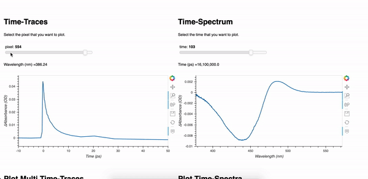

# Visualize Ultrafast Data

This is an interactive dashboard visualizing ultrafast spectroscopy data. Plus, it allows you to plot publishable quality figures.   
Go and try the dashboard from [here](https://visud.herokuapp.com/vis_ultrafast_data). Be aware that it may take about 30 seconds to load the page. 

### Prerequisites

For end-users, you do not need anything other than a browser. 
For developers who want to improve this app or develop their own, followings are needed;
- Python (source code is in Python language).
- Jupyter Notebook.
- Panel and Holoviews from holoviz family.
- Heroku (for deployment).

## Built With

The dashboard is built on a high-level python apps; [panel](https://panel.holoviz.org/), [holoviews](http://holoviews.org/index.html). 
Deployment is provided by [heroku](https://www.heroku.com/). For deployment instructions, check out [minimal heroku demo](https://github.com/pyviz-demos/minimal-heroku-demo).

## Contributing

Feel free to open issue for any problems / errors with the app. Pull requests are welcome, as well.

## Helpful links
- Blog post about this web app. https://earik87.github.io/interactive-web-app/
- Learn more about Holoviz family; http://holoviz.org/
- Check how awesome is panel with some applications; https://awesome-panel.org/
